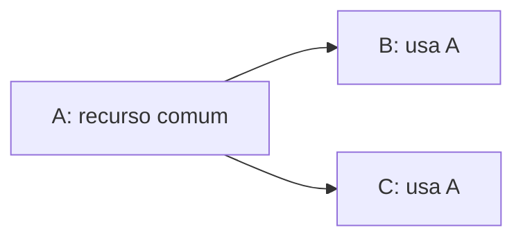

# Tarefas em grafo

## Formato escolhido

Manter um arquivo `.md` por tarefa com frontmatter YAML. O cabeçalho descreve o grafo; o corpo registra objetivo, limites, aceite e evidência. Isso combina leitura humana e processamento estruturado, sem copiar tudo para JSON/YAML separado. Não há garantia universal de menor número de tokens: a economia vem de ler apenas cabeçalhos para selecionar trabalho e depois o corpo da tarefa relevante.

```yaml
---
id: "TASK-NNN"
status: planned
execution_level: standard
execution_rationale: "Integração entre componentes com contrato definido."
specs: ["SPEC-001"]
depends_on: []
provides: ["locale-contract"]
consumes: []
write_scope: ["lib/planner_web/locale.ex"]
blockers: []
---
```

O exemplo é ilustrativo e não cria uma tarefa. IDs são strings estáveis, únicos; a ordem numérica não determina execução. Chaves e identificadores técnicos em inglês; textos explicativos em português.

## Campos obrigatórios

| Campo | Significado |
| --- | --- |
| `id` | `TASK-NNN`, igual ao prefixo numérico do arquivo. |
| `status` | `planned`, `in_progress`, `in_review`, `done` ou `cancelled`. |
| `execution_level` | Capacidade mínima: `basic`, `standard` ou `advanced`; `human` reserva execução exclusiva a uma pessoa. Definida pelo planejador. |
| `execution_rationale` | Justificativa concreta do nível, em português, considerando integrações, ambiguidade técnica e risco. |
| `specs` | IDs das specs aplicáveis; lista vazia para manutenção sem nova regra de produto, justificando no corpo. |
| `depends_on` | IDs de pré-requisitos diretos. É a única fonte das arestas; não manter um `blocks` inverso. |
| `provides` | Entregas/recursos identificados, cada qual com uma tarefa produtora única. |
| `consumes` | Recursos fornecidos por outras tarefas; o produtor deve estar em `depends_on` ou em seus ancestrais. Recursos preexistentes são referências no corpo. |
| `write_scope` | Arquivos, diretórios ou globs previstos para alteração; referência de coordenação, não sandbox nem prova de independência. |
| `blockers` | Impedimentos externos ou decisões pendentes, em português; dependências entre tarefas ficam somente em `depends_on`. |

## Elegibilidade e conclusão

Para agentes, a tarefa precisa ter `execution_level` diferente de `human`. Uma tarefa está executável quando tem `status: planned`, `blockers: []`, todas as dependências `done` e specs aplicáveis `ready` ou `implemented`. Não gravar um segundo status “bloqueada”: ele é derivado dessas condições. Pode-se investigar impedimentos sem iniciar as mudanças dependentes deles.

O implementador passa de `in_progress` para `in_review` após autoavaliação. Achados que exigem código devolvem para `in_progress`; impedimentos ficam em `blockers`. Marcar `done` somente após aceite, review independente de ponta aprovado e integração na base usada pelas consumidoras. Alterações de implementação devem passar pelo CI com cobertura mínima de 70%. Uma branch não integrada ou a mensagem de um subagente não satisfaz uma dependência. `cancelled` não libera dependentes; revisar o plano antes de continuar. Registrar no corpo referência da entrega (commit/PR quando houver), testes, pendências e próximos passos para retomada.

## Coordenação e impedimentos

O [coordenador](../fluxos/coordenacao.md) distribui tarefas elegíveis, confere aceite e revisão independente e realiza um commit de entrega por tarefa aprovada. Implementadores interrompem tarefas com impedimento e seguem o [protocolo de bloqueios](../blocks/README.md). Não criar um novo status: preservar a fase da tarefa e registrar a causa em `blockers`; quando a solução virar uma tarefa, representar esse pré-requisito em `depends_on` e manter o diagnóstico no relatório de bloqueio.

## Recursos compartilhados e sobreposição

Se B e C precisam criar A, extrair A para uma tarefa produtora. B e C declaram consumo e dependência; nenhuma delas recria A. Não criar uma tarefa só porque duas outras leem o mesmo código existente.



As setas significam pré-requisito → consumidora. Definir o contrato entregue por A antes de paralelizar B/C. Se B e C alteram o mesmo recurso, decompor a propriedade da mudança ou serializar explicitamente. Um grafo sem ciclos não prova que os escopos são disjuntos; revisar também `provides`, `consumes` e `write_scope`.

Um arquivo transversal como router ou README pode aparecer em tarefas sequenciais por razões distintas. Não dividir artificialmente uma funcionalidade só para obter conjuntos de arquivos disjuntos. O que não pode se duplicar é a responsabilidade pela mesma entrega.

## Validação do plano

Conferir IDs e recursos únicos, referências existentes, ausência de auto-dependências/ciclos e produtor alcançável para cada consumo. Não aceitar tarefa `done` com bloqueios ou dependências incompletas. Confirmar specs prontas antes de iniciar. Revisar interseções de escopo das tarefas paralelizáveis e também mudanças semânticas em recursos comuns.

O índice é para navegação, não outra base de status. Um diagrama é uma visualização do cabeçalho, não uma segunda fonte editável do grafo. No tamanho atual, não há necessidade de banco, scheduler ou dependência de parsing no aplicativo. Ferramentas futuras podem ler estes metadados com parser YAML seguro e validar as regras acima; a validação automática contínua ainda não foi implementada.

## Níveis mínimos de execução

| Nível | Adequação | Exemplos e limites |
| --- | --- | --- |
| `basic` | Mudança local, contrato fechado, padrão existente e baixo risco | Tradução de catálogo definido, ajuste localizado, teste de cenário explícito. Não decidir arquitetura, migração destrutiva ou concorrência. |
| `standard` | Integração delimitada entre componentes, com invariantes claras | Fluxo web/contexto já especificado, refatoração pequena com regressões cobertas. Decisões de produto continuam fora do escopo. |
| `advanced` | Agente de ponta para integração sensível, concorrência, ciclo de vida complexo ou risco de dados | Isolamento de sessão/processos, migrações delicadas, contratos transversais. Capacidade alta não autoriza implementar specs ambíguas. |

Classificar pelo ponto mais exigente da tarefa, não pelo número de arquivos. `execution_rationale` deve permitir auditar a escolha. Quando um trecho difícil sustenta vários simples, extrair a tarefa produtora `advanced` e atribuir níveis adequados às consumidoras. Reclassificar somente após análise explícita de escopo; não reduzir o nível por indisponibilidade de modelo.

Os níveis são requisitos de capacidade, sem vinculação a fabricante/modelo fixo. Planejamento e aprovação independente usam agente de ponta; não são níveis alternativos de implementação.

## Pacote de execução e aceite

No corpo, listar contexto de entrada (arquivos/contratos), critérios numerados e claros, casos de teste necessários e limites. Cada critério deve permitir observar resultado sem ler a conversa: estado inicial, ação/condição e resultado, incluindo rejeições relevantes. Pode referenciar IDs estáveis da spec com links diretos, desde que não deixe decisões implícitas. Preservar a spec como fonte do comportamento.

## Granularidade e scaffold

Uma spec agrega arquitetura, invariantes e vários casos de uso; uma tarefa entrega um incremento pequeno e verificável desse contrato. Separar geração inicial, adaptação das regras e integração das ações quando puderem ficar verdes independentemente. Não criar uma tarefa para “todo o domínio” ou “toda a interface” quando existirem passos concretos menores.

Quando houver gerador adequado, a tarefa informa comando exato, recursos produzidos, ajustes posteriores e o que fica fora da etapa. Gerar cada recurso uma única vez; consumidoras adaptam o scaffold ou usam opções que evitem regenerar contexto/schema. Sem gerador pertinente, identificar o recurso existente a editar. Os comandos de scaffold ficam nas tarefas; operação da aplicação continua no README.

## Registro de revisão

Cada tarefa contém uma seção de revisão com: estado pendente/aprovado/alterações solicitadas/bloqueado; identidade do revisor e se independente; alvo/base do diff; critérios e evidências; achados; cobertura/evals aplicáveis; referência da integração. Não duplicar status da tarefa no índice. Revisão pendente e integração pendente não liberam dependentes. Ver [fluxo de review](../fluxos/review.md).

## Execução humana

`human` é uma reserva de responsabilidade, não uma estimativa de dificuldade. Todos os agentes recusam executar tarefas desse nível, inclusive parcialmente ou via delegação. Ao encontrar dependência humana incompleta, informar ID/título, o que a pessoa precisa fazer e quais tarefas dependentes não podem prosseguir. Não reclassificar para contornar a reserva.

Pode-se explicar instruções e conferir evidência em leitura. Não criar workflow, alterar configuração local/remota ou executar passos da tarefa humana. Trabalho independente continua permitido. Apenas confirmação explícita da pessoa, acompanhada das evidências de aceite, permite registrar conclusão. Para este nível, a validação humana documentada substitui a exigência de aprovação independente por agente; uma revisão em leitura pode complementar, mas não substituir a execução humana.

O corpo é escrito para humanos: objetivo, passos essenciais, aceite e onde procurar ajuda externa. Evitar instruções de prompting, inventário exaustivo e exigência de produzir logs extensos. O cabeçalho mantém o mesmo esquema; `write_scope` cobre arquivos locais, e configurações externas são descritas no corpo. A classificação `human` já é a reserva, não precisa ser repetida em `blockers`.
